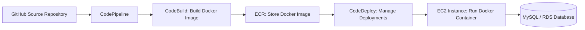

# 🚀 AWS CI/CD Pipeline for Dockerized PHP + MySQL Application  

## 🌟 Objective & Overview  

This project demonstrates **end-to-end CI/CD automation** on AWS for a **Dockerized PHP web application** connected to a **MySQL (RDS)** database.  

The pipeline automates the entire process — from source code in GitHub to containerized deployment on an EC2 instance — using **AWS CodePipeline**, **CodeBuild**, and **CodeDeploy**.  

The goal is to simulate a **real-world DevOps workflow** that ensures continuous integration, continuous delivery, and zero-downtime deployments for scalable web applications.  

---

## 🛠️ Architecture Summary  



**Flow:** GitHub → CodePipeline → CodeBuild → ECR → CodeDeploy → EC2 (Docker) → MySQL/RDS

---

## 🧱 Technologies & Services Used  

### 🧩 AWS Services  
- **EC2** – Host the containerized PHP application.  
- **CodeDeploy** – Automate deployment across EC2 instances.  
- **CodeBuild** – Build Docker image and push it to ECR.  
- **CodePipeline** – Orchestrate the CI/CD workflow.  
- **IAM** – Manage permissions and roles for services.  
- **ECR** – Store Docker images.  
- **S3** – Store application artifacts.  
- **RDS (Optional)** – Host MySQL database.  

### ⚙️ Tools & Dependencies  
- **Docker** – Containerization platform for PHP app.  
- **AWS CLI** – Manage AWS services via command line.  
- **Ruby** – Required for CodeDeploy agent.  
- **CodeDeploy Agent** – Executes deployment commands on EC2.  
- **MySQL** – Backend database.  
- **PHP** – Application runtime.  
- **Ubuntu Linux** – EC2 instance operating system.  

---

## ⚙️ Step-by-Step Setup Process  

### 🖥️ 1. Launch EC2 Instance  
- Choose **Ubuntu Server 22.04 LTS**.  
- Enable ports **22 (SSH)**, **80 (HTTP)**, and **3306 (MySQL)** in the security group.  

---

### 🧮 2. Install Dependencies on EC2  

```bash
sudo apt update -y
sudo apt install -y mysql-server docker.io unzip ruby-full wget
curl "https://awscli.amazonaws.com/awscli-exe-linux-x86_64.zip" -o "awscliv2.zip"
unzip awscliv2.zip
sudo ./aws/install
```

---

### 🧩 3. Install and Configure AWS CodeDeploy Agent  

```bash
cd /home/ubuntu
wget https://aws-codedeploy-ap-south-1.s3.ap-south-1.amazonaws.com/latest/install -O install
chmod +x install
sudo ./install auto
sudo systemctl daemon-reload
sudo systemctl enable codedeploy-agent
sudo systemctl start codedeploy-agent
sudo systemctl status codedeploy-agent
```

> 💡 **Tip:**  
> If you face `AccessDenied` or `Cannot reach InstanceService` errors, remove any existing AWS credentials file:  
> ```bash
> sudo rm -rf /root/.aws /home/ubuntu/.aws
> sudo systemctl restart codedeploy-agent
> ```

---

### 🔐 4. Configure IAM Roles  

#### 🔹 **CodeDeploy-EC2-Role** (Attach to EC2 instance)
**Policies:**  
- `AmazonEC2RoleforAWSCodeDeploy`  
- `AmazonS3FullAccess`  
- `AmazonEC2ContainerRegistryReadOnly`  
- `AmazonSSMManagedInstanceCore`

#### 🔹 **CodeDeployServiceRole** (Used by CodeDeploy)
**Policy:**  
- `AWSCodeDeployRole`

#### 🔹 **CodeBuildServiceRole** (Used by CodeBuild)
**Policies:**  
- `AWSCodeBuildAdminAccess`  
- `AmazonEC2ContainerRegistryPowerUser`

---

### 🗂️ 5. Prepare Application Files  

Ensure your GitHub repository includes the following at its **root level**.:

```
📁 Repository Root
│
├── appspec.yml
├── buildspec.yml
├── Dockerfile
├── scripts/
│   ├── start.sh
│   └── stop.sh
├── app/
│   ├── index.php
│   └── db.php
```

> ✅ **Important:**  
> `appspec.yml` must be at the **root** of the repository for CodeDeploy to detect it correctly.

---

### 🧱 6. Configure AWS CodeBuild  

- **Environment:** Ubuntu Standard 7.0  
- **Privileged Mode:** ✅ Enabled (required for Docker)  
- **Service Role:** Attach `CodeBuildServiceRole`  
- **Buildspec:** Use `buildspec.yml` file from repository  

This step automates:  
- Docker image build  
- Pushing image to **Amazon ECR**  
- Generating deployment definitions for CodeDeploy  

---

### 🚀 7. Create AWS CodeDeploy Application  

- **Application name:** `php-rds-app`  
- **Deployment group:** `php-rds-app-group`  
- **Environment type:** EC2/on-premises  
- **Deployment type:** In-place  
- **Service role:** `CodeDeployServiceRole`  
- **EC2 instance:** Select the instance with the tag used during creation  

---

### 🔄 8. Set up AWS CodePipeline  

1. **Source:** GitHub repository (connect to your repo and branch).  
2. **Build:** AWS CodeBuild project.  
3. **Deploy:** AWS CodeDeploy application and deployment group.  

> ✅ Each push to GitHub triggers the CI/CD pipeline automatically.

---

### 🔁 9. Trigger the Pipeline  

1. Commit and push changes to your PHP code:  
   ```bash
   git add .
   git commit -m "Updated PHP app"
   git push origin main
   ```
2. CodePipeline runs automatically:
   - **Source → Build → Deploy**  
3. CodeDeploy deploys the new Docker image to EC2.

---

### 🔍 10. Verify Deployment  

On your EC2 instance:

```bash
sudo docker ps
```

Access your app in a browser:
```
http://<EC2-Public-IP>
```

You should see your PHP application connected to MySQL/RDS.

---

## 🧩 Troubleshooting  

| Issue | Cause | Solution |
|-------|--------|-----------|
| `Cannot reach InstanceService` | IAM or agent misconfiguration | Restart agent or check IAM role |
| `AppSpec not found` | `appspec.yml` misplaced | Move `appspec.yml` to root of repository |
| `AccessDenied` | Missing S3/ECR permissions | Attach required policies to IAM role |
| `Agent not running` | Agent crash or missing Ruby | Reinstall CodeDeploy agent and Ruby |

---

## 🧠 Outcome  

- Fully automated CI/CD pipeline for PHP + MySQL app.  
- Builds Docker image and pushes to ECR automatically.  
- Deploys container on EC2 via CodeDeploy with no manual steps.  
- Demonstrates DevOps skills in **automation, troubleshooting, AWS, and containerization**.

---

## 🌿 Key Highlights  

✅ End-to-end AWS CI/CD workflow  
✅ Docker + ECR integration  
✅ Automated build and deployment pipeline  
✅ Real-world deployment automation use case  
✅ Demonstrates hands-on expertise in AWS DevOps  

---

## 🦯 Final Architecture  

```
Developer → GitHub → CodePipeline → CodeBuild → ECR → CodeDeploy → EC2 (Docker) → MySQL/RDS
```

---

## 👨‍💻 Author  

**Ritik Kumar Sahu**  
📧 [ritikkumar3g@gmail.com]  
💼 Cybersecurity & DevOps Engineer | AWS | Docker | Kubernetes | Jenkins | Terraform  
